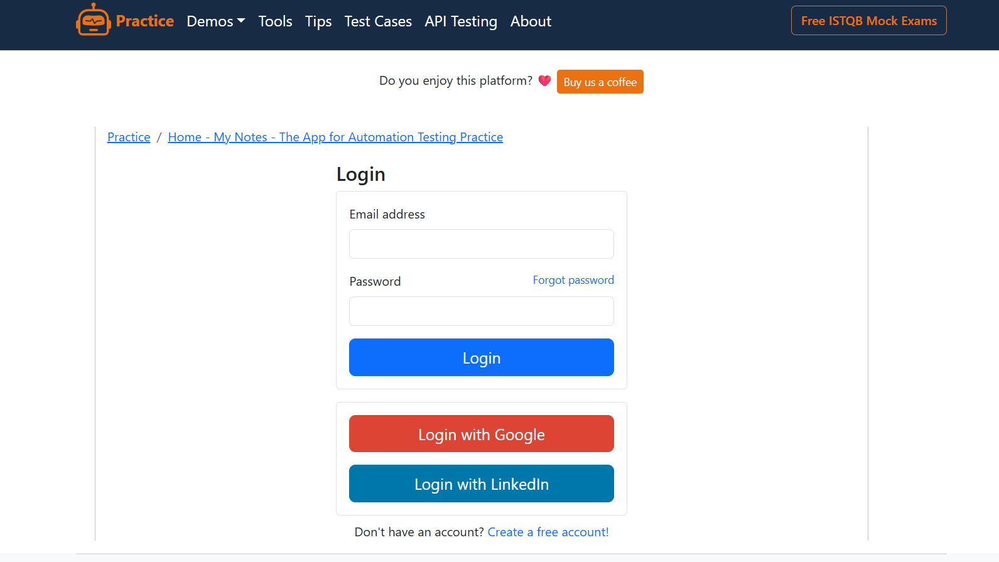
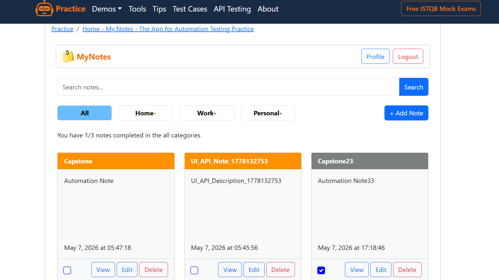
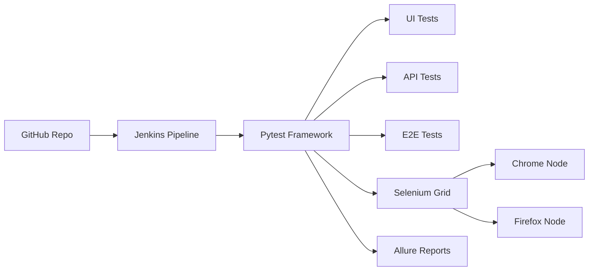
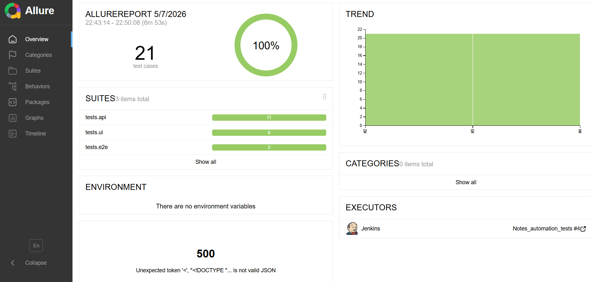

# Notes Automation Framework

A scalable automation testing framework built using Selenium, Pytest, Requests, Docker, Selenium Grid, Jenkins, and Allure Reporting.

This framework supports:
- UI Automation Testing
- API Automation Testing
- Hybrid UI + API End-to-End Testing
- Parallel Execution
- Dockerized Selenium Grid
- Jenkins CI/CD Integration
- Allure HTML Reporting

# Test Documentation

The project includes detailed QA documentation covering:
- Requirement Traceability Matrix (RTM)
- Test Scenarios
- Manual Test Cases
- Automation Coverage Mapping
- Positive & Negative Test Flows
- API and UI Validation Coverage

## Manual Report Document

| Document | Description |
|---|---|
| [Traceability Matrix & Test Cases](Manual_testing_report.xlsx) | Complete QA test documentation |


---

# Overview


The Login Page provides secure authentication functionality for registered users of the Notes application.


The dashboard contains note cards with options to View, Edit, Delete, and mark notes as completed using checkboxes.  
It also includes search functionality, category filters, profile access, and quick note creation through the “Add Note” button.


# Tech Stack

<p align="center">


</p>

# Framework Features


# Project Execution Guide

## Run Tests

Allure reporting is already configured in the framework configuration files.  
Simply execute the tests using:

```bash
pytest
```

---

# Open Allure Report

```bash
allure serve reports/allure-results
```

---

# Docker Selenium Grid Execution

```bash
docker-compose up -d # Start Selenium Grid
docker-compose down  # Stop Selenium Grid
```

---

# Switch Execution Mode


```text
config/environment.py
```


```python
"execution_mode": "local"
#change local to grid
"execution_mode": "grid"
```

---

# Run Tests 

```bash
pytest -m ui          # Run UI tests
pytest -m api         # Run API tests
pytest -m e2e         # Run End-to-End tests
pytest -n 2           # Run tests in parallel
```

---


## Reporting
- Allure HTML Reports
- Screenshot attachment on failure
- API response attachment support



## CI/CD
- Jenkins Declarative Pipeline
- Report publishing

## Selenium Grid
- Docker-based Selenium Grid
- Chrome & Firefox nodes
- Distributed execution support

---

# Project Structure

```text
Notes_Automation/
│
├── api/
├── pages/
├── tests/
│   ├── api/
│   ├── ui/
│   └── e2e/
│
├── reports/
├── config/
├── conftest.py
├── pytest.ini
├── requirements.txt
├── docker-compose.yml
└── Jenkinsfile